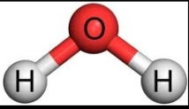

A triatomic molecule has three atoms with two covalent bonds between two pairs of atoms. Examples are carbon dioxide (CO2), ozone (O3) and water (H2O). There are two internuclear distances and a bond angle (refer the following figure) and these three independent variables determine the total energy of a triatomic molecule. Thus, in addition to the bond stretching potential we need to understand the role of bond angle energy in determining molecular stability.

The bond angle energy corresponds to changes in the angle between bonds. As with bond length, the bond angles have an equilibrium value, and any deviation increases the potential energy. The potential energy surface associated with the bond angle can be approximated as a harmonic well using the following function.

U(θ) = Kθ ( θ − θ 0) 2

 where Kθ is an empirically determined constant, θ is the current bond angle, and θ0 is the equilibrium angle. 

The energy surface ensures that any perturbation to the equilibrium geometry of a triatomic molecule increases the total potential energy of the molecule.

In this experiment, one of the atoms of a triatomic molecule is fixed at a position. The bond lengths and bond angles are varied using using optical forces. The potential energies and corresponding internuclear forces are measured as a function of the end-to-end distance of the molecule. 
