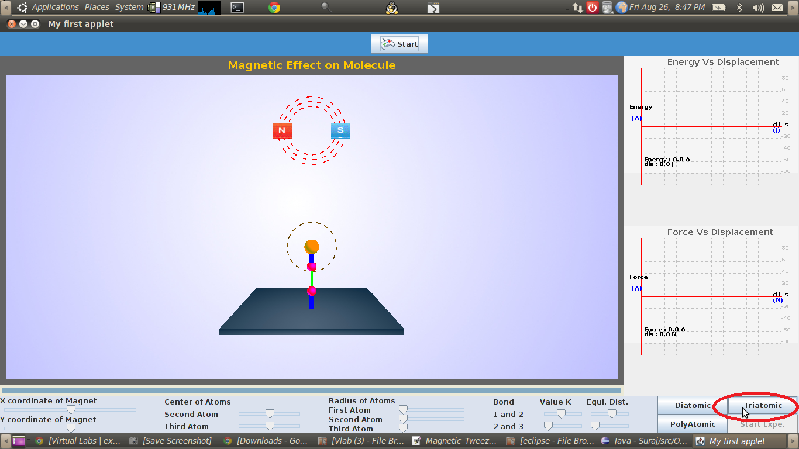
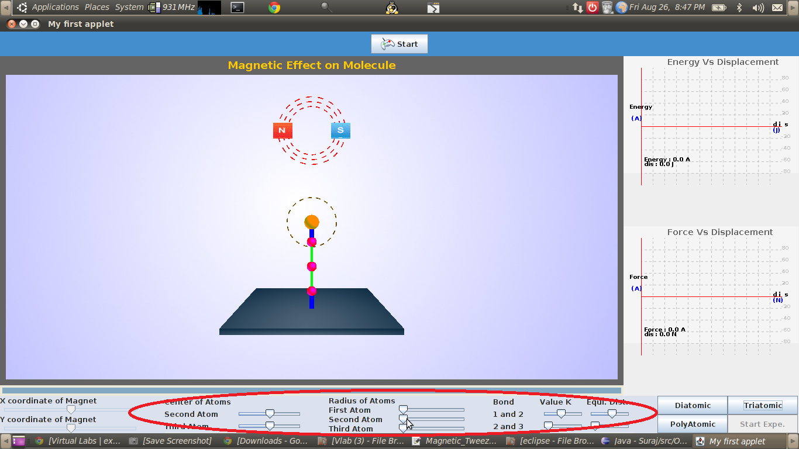
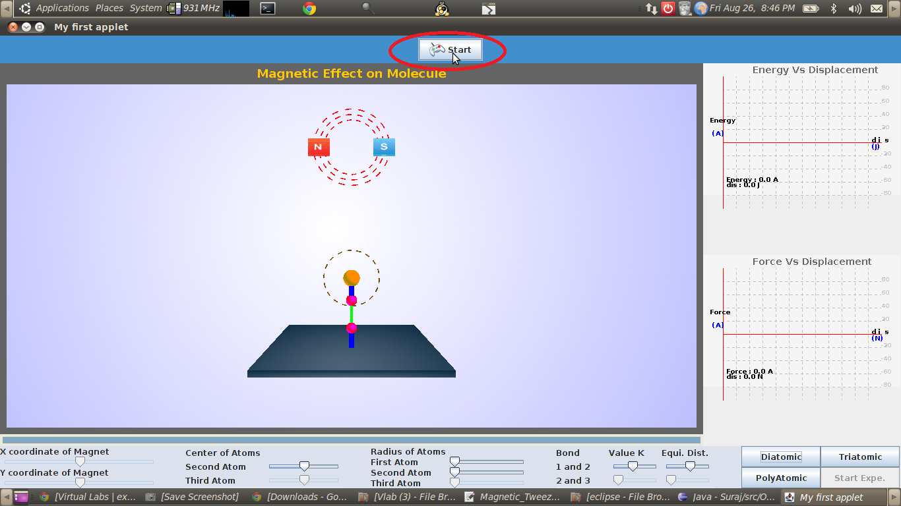
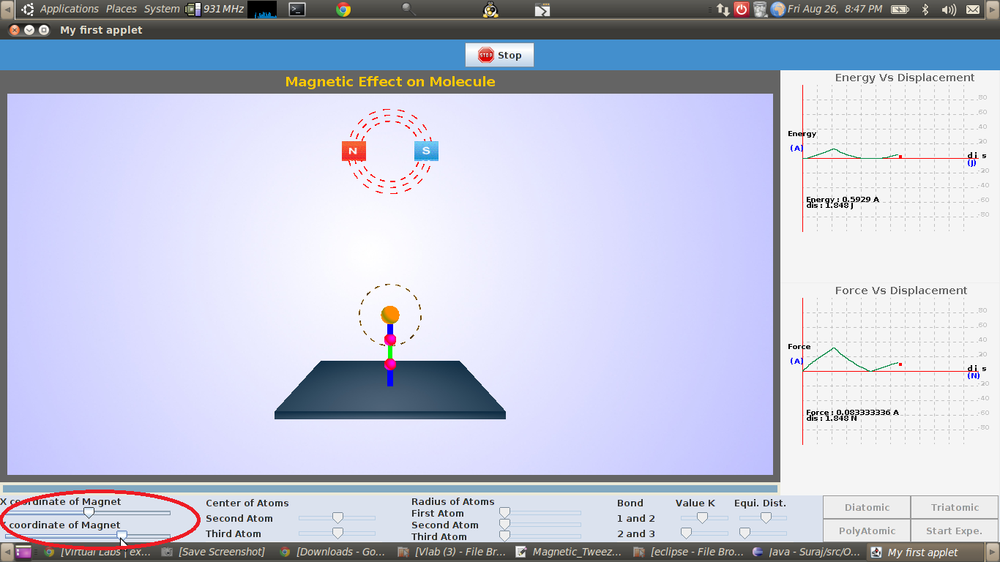
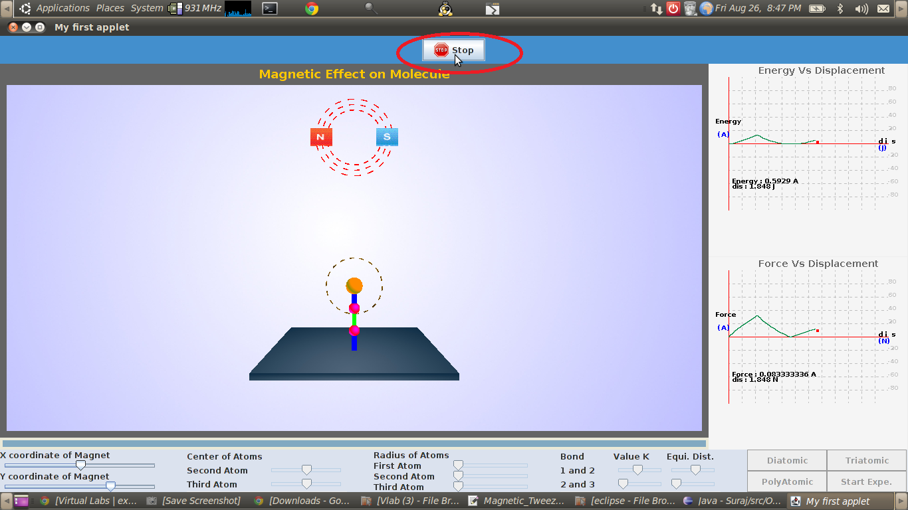

The initial display shows the experimental set up for a default triatomic molecule. To perform this experiment on a molecule of your choice, there are certain parameters to be initialized and the procedure detailed here can be followed.
STEP 1: Select the tri atomic molecule by clicking on the tab provided.

STEP 2: Select a suitable value of the three spring constants (two for bond stretching and one for angle bending) and equilibrium bond length and bond angle using the sliders provided on the display menu,equlibrium length and size of the atoms by using the slider provided on the display menu.

STEP 3: click here to start the experiment.

STEP 4: The magnet position can be varied using the slider provided.

STEP 5: The internuclear force and the potential energy are plotted as a function of the internuclear seperation.

